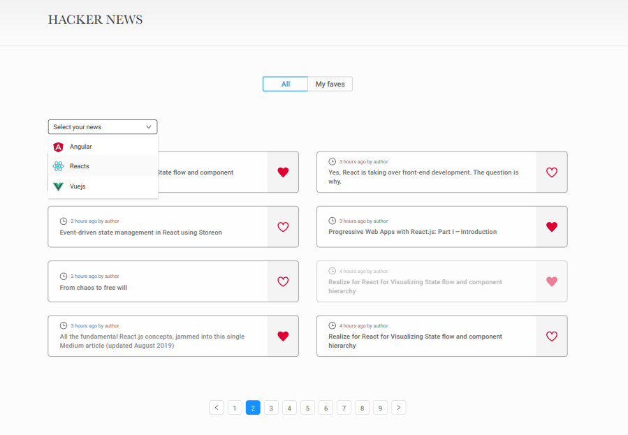

# News App

## Overview

This web application, built with React, provides a user-friendly interface for browsing posts from Hacker News. Users can filter posts based on the framework (React, Angular, Vuejs) and navigate through the results with pagination. The app supports persistent storage for selected filters and favorited posts, ensuring a seamless user experience.



## Installation

To run this project locally, follow these steps:
------------------
1. Clone the repository:
```bash
git clone https://github.com/rod-cami/news-app.git
cd news-app
```
2. Install dependencies:
```bash
npm install
```
3. Set the Hacker News API URL as an environment variable:
```bash
npm install
```
4. Start the development server:
```bash
npm start
```
Open [http://localhost:3000](http://localhost:3000) in your browser

## Usage

### Filter Posts

Use the dropdown selector to filter posts based on the selected framework (React, Angular, Vuejs). The selected filter is persisted in local storage.

### View Favorited Posts

Switch to the "Favs" view to see your favorited posts. Favorited posts are stored locally and persist across sessions.

### Responsive Design

The app is designed to work seamlessly across various devices, ensuring a responsive and accessible user experience.

### Open Post Details

Clicking on a row opens a new tab with the link to the post (story_url).

### Like Button

Clicking the "like button" adds the post to your favorites. This action is stored locally.

### Hover Effect

When hovering over a row, the entire row and its children (texts, icons, like button, etc.) experience a subtle opacity effect.

## Technologies Used

* React
* HTML/CSS
* Netlify (for deployment)
* Hacker News API

## Deployment

The live version of the app can be accessed [here](https://test-news-app-cr.netlify.app/ "Link to deployed solution")

## Contributors

* Rodríguez Camila 

## License

This project is licensed under the  [MIT License](LICENSE).


## Additional Information
For more details on project configuration, deployment, and troubleshooting, refer to the [Create React App documentation](https://facebook.github.io/create-react-app/docs/).
